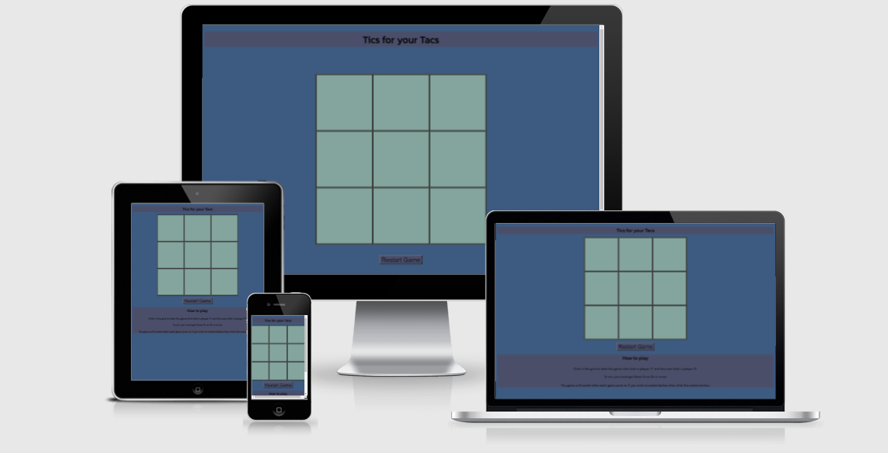
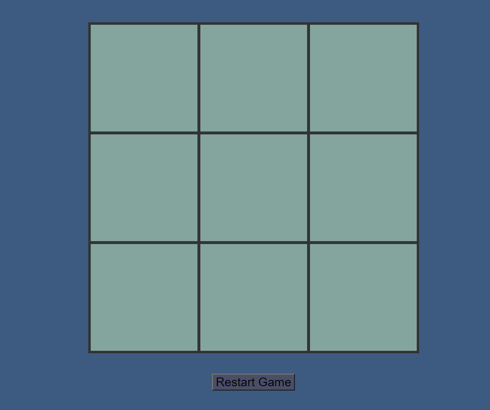
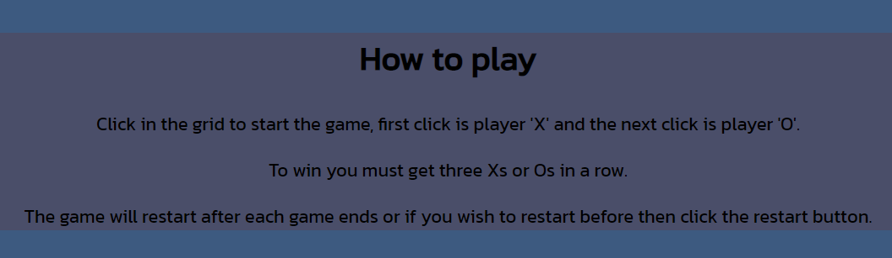

# Tics for your Tacs

An online version of the classic Tic Tac Toe or Noughts and Crosses game that is free to be played and enjoyed by all for children and adults. This game is for two players and you win by getting the same symbol three times in a row. Once a game has been won or drawn there will be an alert and the grid will clear for the next game to commence. Please see the game layout on different displays below and the game can be found [here.](https://zams93.github.io/Tics-for-your-Tacs/)

## Features

### Header

* Found at the top of the page the header shows a fun title which also indicates what the game is.
* The colours used were vivid but also intentionally blended to the background to help the heading stand out but still go with the theme. 

### Playing the Game

* To start the game the first player clicks anywhere in the grid to add their symbol.
* The second player will then click in the grid to add their symbol.
* If a player wishes to restart the game before a result is produced a restart game button has also been added to allow this option.

### The Game Results

* Each player takes it in turns to click, once a player has got three in a row an alert will appear advising which player has won and the game will restart.
* If there is no winner an alert advising the game is a draw will appear and the game will restart.

### Footer

* Located at the bottom of the page there is a footer which advises players on how the game works and the rules.
* The footer is the same colour as the header to keep consistency on the page and also fits in with the colour scheme but still stands out.

### Features to add later

Down the line I would like to expand this project by adding a feature which tallies up player's scores when multiple games are played. 

### Testing

* This game has been tested on multiple browsers: Edge, Chrome, Firefox, Internet Explorer.
* Each winning cell combination has been tested to make sure all are working correctly.
* The layout has been checked with multiple users to confirm it is easy to read and see the text on multiple screens, media queries were used to help the game fit on smaller screens. 
* Confirmed the font and colours are accesible on all systems.
* Confirmed this game is responsive, displays well and functions on different screens. 

## Validator Testing

* HTML

No errors were found when code was put through the official W3C validator.

* CSS

No errors were found when code was put through the official Jigsaw validator.

## Bugs

The main issue on this project was getting the code to identify a draw in the game as I tried using a 'else if' loop to have the data identified as a draw and to produce an alert. However this was not able to override the criteria to detect a win. This was solved by creating a separate function to detect a draw rather than depending on just the win to be false. 

## Unfixed Bugs

There are no bugs and the game is running as it should.

## Deployment

I followed the steps below to deploy my website on GitHub:

1. Go in to Github repository and click on “Settings”
2. Find the “Source” section and select “Master Branch”
3. Once “Master Branch” has been selected, the website is now published with link provided.

## Resources

https://coolors.co/palettes - Color inspiration 

https://fonts.google.com/ - Fonts 
